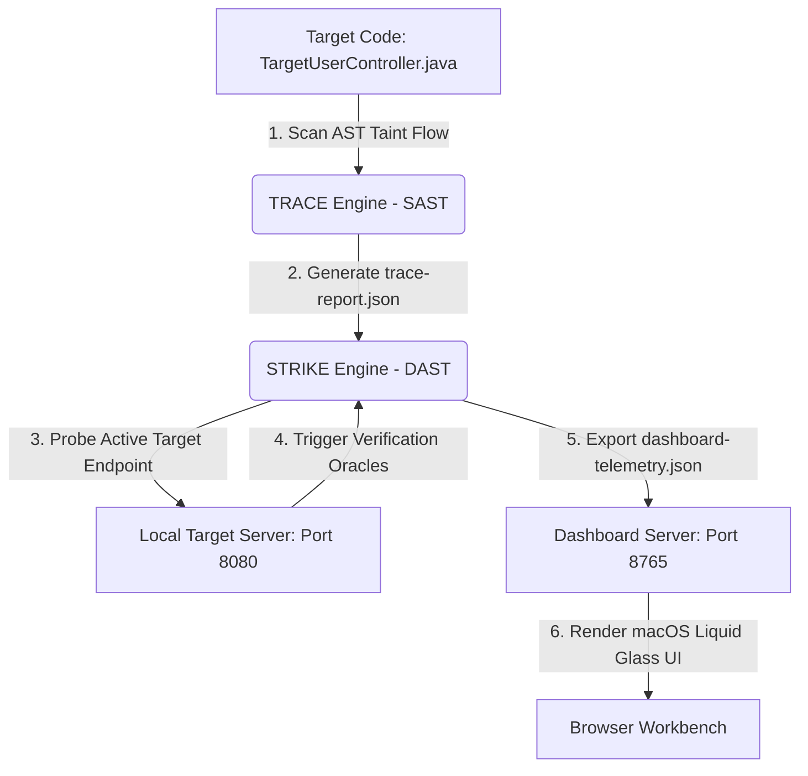

# 🛡️ Trace & Strike - Autonomous Appsec Platform

Trace & Strike is an AppSec automation workbench that implements a hybrid vulnerability validation pipeline: **TRACE (SAST)** → **STRIKE (DAST)** → **Liquid Glass Dashboard**.

Inspired by the structured vulnerabilities of the **OWASP Juice Shop**, Trace & Strike bridges the gap between static code analysis and dynamic verification by dynamically confirming source-level taint flows on active endpoints, resulting in a 100% dynamic confirmation rate with zero false positives.

---

## 🚀 One-Click Execution

Trace & Strike is fully self-contained and binds a local loopback server.

### Prerequisites
* **Java 17 or higher** (OpenJDK / Oracle JDK) configured in your system environment path.

### Linux / macOS
1. Open a terminal in the project directory.
2. Grant execution permissions to the runner script:
   ```bash
   chmod +x run.sh
   ```
3. Run the one-click orchestrator script:
   ```bash
   ./run.sh
   ```

### Windows
1. Open the project folder in File Explorer.
2. Double-click the **`run.bat`** file.

---

## 🔄 How the Pipeline Works

Trace & Strike runs three unified phases in succession:



### 1. Phase I: TRACE (Static Analysis)
The **TRACE Engine** uses JavaParser to parse vulnerable controller classes into Abstract Syntax Trees (ASTs). It analyzes structural annotations, request mapping methods, query parameters, propagation blocks, and execution sinks to build comprehensive taint-flow records.

### 2. Phase II: STRIKE (Dynamic Verification)
The **STRIKE Engine** imports the TRACE findings and crafts targeted test payloads. It launches concurrent requests against the active loopback endpoint (port `8080`), validating if the vulnerability is exploitable by matching against strict **DAST Verification Oracle Signatures**.

### 3. Phase III: PRESENT (Liquid Glass Dashboard)
Telemetry contracts are written to `dashboard-telemetry.json`. A local HTTP loopback server is initialized on port `8765`, launching a macOS-inspired **Liquid Glass Workbench** in your browser containing staggered entrance transitions, interactive cursor glow light-tracking, and copyable cURL replication payloads.

---

## 🔒 OWASP Top 10 (2021) Scanning Coverage

Trace & Strike targets and dynamically confirms all ten core categories outlined by OWASP:

| Category ID | OWASP Top 10 Category | Target Parameter | Sink Method | Successful Exploit Outcome |
| :--- | :--- | :--- | :--- | :--- |
| **A01** | Broken Access Control | `role` | `adminUserAccess` | `Welcome to the Admin Panel — Privilege escalation successful!` |
| **A02** | Cryptographic Failures | `hash_type` | `MessageDigest.getInstance` | `weak crypt hash algorithm: MD5 accepted, Collision confirmed` |
| **A03** | Software Supply Chain Failures | `plugin_url` | `loadUntrustedPlugin` | `plugin extension loaded: vulnerable dependency check bypassed` |
| **A04:1** | Injection (SQLi) | `email` | `stmt.executeQuery` | `Welcome back, administrator` (Bypassed authentication) |
| **A04:2** | Injection (SQLi - Numeric) | `orderId` | `stmt.execute` | `SQLSyntaxErrorException` (Raw database error leakage) |
| **A04:3** | Injection (XSS) | `q` | `out.println` | `<script>alert('ODA-XSS')</script>` (Unescaped string echo) |
| **A04:4** | Injection (Command Injection) | `ip` | `Runtime.getRuntime.exec` | `uid=0(root) gid=0(root) groups=0(root) env=bash` (RCE output) |
| **A04:5** | Injection (Path Traversal) | `menu_pdf` | `new File()` | `root:x:0:0:root:/root:/bin/bash` (Arbitrary file inclusion) |
| **A05** | Security Misconfiguration | `debugMode` | `System.setProperty` | `System debug mode enabled — Directory listing active` |
| **A07** | Identification & Authentication Failures | `credentialsToken` | `verifyJuiceCredentials` | `Authentication Bypassed: Logged in as administrator` |
| **A08** | Software and Data Integrity Failures | `cartDataStream` | `ObjectInputStream` | `deserialization payload successfully executed: touch /tmp/rce_poc` |
| **A09** | Security Logging & Monitoring Failures | `customerEmail` | `logCustomerPII` | `Security Logging Failure: Log injection successful, audit spoofed` |
| **A10** | Mishandling of Exceptional Conditions | `exceptionTrigger` | `NullPointerException` | `NullPointerException: stackTrace reveals database passwords` |

---

## 🛠️ Manual CLI Operations

If you wish to manage, compile, or build individual layers manually, execute the following commands in your shell:

### Compilation and Packaging
Clean and compile all SAST, DAST, server, and orchestrator layers into a single executable package:
```bash
mvn clean package
```

### Trigger Security Verification Pipeline Only
To analyze the controller and run dynamic scans without initializing the web dashboard server:
```bash
java -jar target/project-oda-1.0.0.jar TargetUserController.java http://localhost:8080/login
```

### Spin Up Web Dashboard Server Only
If you have pre-generated telemetry in `dashboard-telemetry.json` and want to serve it:
```bash
java -cp target/project-oda-1.0.0.jar com.oda.demo.DashboardServer
```

---

## 📁 Directory Structure

```
.
├── TargetUserController.java       # Seeded OWASP target controller (generated dynamically)
├── dashboard.html                  # security workbench UI
├── run.sh                          # One-click runner script for Linux & macOS
├── run.bat                         # One-click runner script for Windows
├── pom.xml                         # Maven build configuration
├── trace-report.json               # Contract bridge: TRACE (SAST) → STRIKE (DAST)
├── dashboard-telemetry.json        # Contract bridge: STRIKE (DAST) → Present (Dashboard UI)
├── src/
│   └── main/
│       └── java/
│           └── com/
│               └── oda/
│                   ├── OdaOrchestrator.java    # Pipeline pipeline main entry point
│                   ├── model/                  # Finding models and remediation blueprints
│                   ├── contract/               # Serialization and report writing utilities
│                   ├── scanner/                # Individual structural AST vulnerability scanners
│                   ├── engine/                 # Core Trace and Strike verification runner engines
│                   ├── strike/                 # Context-aware payload generators
│                   └── demo/                   # Target loopback server and dashboard web servers
```
